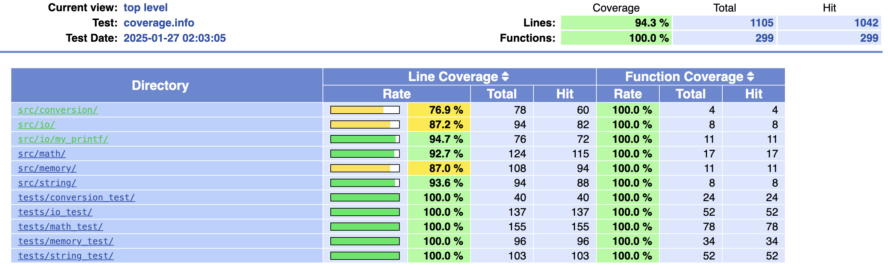

# libmylibc

 

## Description

**libmylibc** is a custom standard library implementing various string manipulation, memory management, type conversion, input/output, and mathematical operations.

This project includes:
- An optimized implementation of several common C functions
- A complete set of unit tests using **Criterion**
- A code coverage report generated with **lcov**

## Project Structure

```
libmylibc/
├── include/          # Header files
├── src/              # Function implementations
│   ├── conversion/   # Conversion functions
│   ├── io/           # Input/output functions
│   ├── math/         # Mathematical functions
│   ├── memory/       # Memory management functions
│   ├── string/       # String manipulation functions
├── tests/            # Unit tests
├── Makefile          # Build script
├── README.md         # Project documentation
```

## Installation

### Clone the project

```sh
git clone https://github.com/yourusername/libmylibc.git
```

### Install dependencies

On **Linux** (Debian/Ubuntu):
```sh
sudo apt update
sudo apt install criterion lcov
```

On **macOS** (Homebrew):
```sh
brew install criterion lcov
```

## Compilation and Installation

To compile the library, run the following command:

```sh
make
```

To clean the generated files:

```sh
make clean
```

To remove the compiled library:

```sh
make fclean
```

To fully recompile the project:

```sh
make re
```

## Running Tests

The project uses the **Criterion** library for unit tests. To run all tests:

```sh
make tests_run
```

### Code Coverage Report

A detailed code coverage report is generated using **lcov**. To generate the report, run:

```sh
make coverage
```

This will generate a `coverage_report/` directory containing the HTML files to view the report.

To view the report:

```sh
open coverage_report/index.html  # macOS
xdg-open coverage_report/index.html  # Linux
```

### Coverage Report Preview:



## Implemented Functions

### Conversion
| Function   | Description                        |
|------------|------------------------------------|
| `my_atof`  | Converts a string to a float       |
| `my_atoi`  | Converts a string to an integer    |
| `my_htoi`  | Converts a hexadecimal string      |
| `my_itoa`  | Converts an integer to a string    |

### Input/Output
| Function           | Description                       |
|-------------------|-----------------------------------|
| `my_get_next_line` | Reads a line from input           |
| `my_putchar`       | Writes a character to output      |
| `my_putnbr`        | Writes a number to output         |
| `my_putnbr_base`   | Writes a number in a given base   |
| `my_putstr`        | Writes a string to output         |
| `my_printf`        | Formatted output function         |

### Mathematical Functions
| Function       | Description                          |
|---------------|--------------------------------------|
| `my_abs`       | Returns the absolute value           |
| `my_cos`       | Computes the cosine of a number      |
| `my_exp`       | Computes the exponent of a number    |
| `my_factorial` | Computes the factorial               |
| `my_isprime`   | Checks if a number is prime          |
| `my_log`       | Computes the logarithm of a number   |
| `my_max`       | Finds the maximum of two numbers     |
| `my_min`       | Finds the minimum of two numbers     |
| `my_pow`       | Computes the power of a number       |
| `my_sin`       | Computes the sine of a number        |
| `my_sqrt`      | Computes the square root of a number |

### Memory Management
| Function    | Description                        |
|-------------|------------------------------------|
| `my_bzero`  | Sets memory to zero                |
| `my_malloc` | Allocates memory                   |
| `my_free`   | Frees allocated memory             |
| `my_memcpy` | Copies memory between locations    |
| `my_memmove`| Moves memory areas safely          |
| `my_memset` | Fills memory with a constant byte   |
| `my_realloc`| Resizes a memory block              |
| `my_strdup` | Duplicates a string                 |

### String Manipulation
| Function         | Description                         |
|-----------------|-------------------------------------|
| `my_nbrlen`      | Computes the length of a number     |
| `my_nbrlen_base` | Computes number length in base      |
| `my_strcat`      | Concatenates two strings            |
| `my_strcmp`      | Compares two strings                |
| `my_strcpy`      | Copies a string                     |
| `my_strlen`      | Calculates string length            |
| `my_strncmp`     | Compares two strings up to n chars  |
| `my_strncpy`     | Copies a string up to n chars       |
| `my_strstr`      | Finds a substring in a string       |

## License

This project is licensed under the MIT License - see the [LICENSE](LICENSE) file for details.

---

Thank you for using **libmylibc**! 😊

